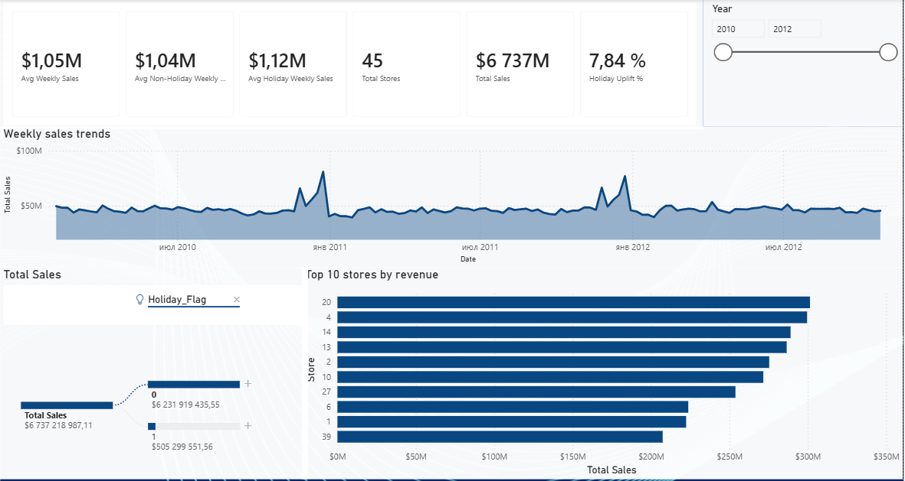
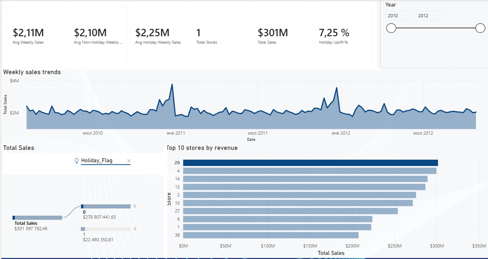

# 📊 Walmart Sales Analytics & Performance Dashboard


An end-to-end interactive Power BI analytical solution analyzing historical sales data across 45 Walmart stores. This project evaluates revenue performance, seasonal dynamics, store-level efficiency, and quantifies the exact revenue impact of holiday periods using custom DAX measures and modern UI design principles.

---

## 📸 Dashboard Gallery

| Executive Overview | Top Store (#20) Analysis | Decomposition Tree (Root-Cause) |
|:------------------:|:-----------------------:|:------------------------------:|
|  |  |  |

---

## 🎯 Executive Summary & Key Business Questions

This project was built to address critical retail management decisions:
1. **Revenue Baseline:** What is the macro-level revenue across all stores and historical timeframes?
2. **Holiday Impact Quantification:** Do official holiday weeks generate a statistically significant sales uplift compared to non-holiday weeks?
3. **Store Efficiency:** How is total revenue distributed across individual locations, and who are the key drivers in the top 10 rankings?
4. **Time-Series Seasonality:** When do critical sales spikes occur, and how predictable are end-of-year surges?

---

## 💡 Key Business Insights

- **Total Generated Sales:** **$6,737M** aggregate revenue across **45 active stores** (2010–2012).
- **Holiday Uplift (+7.84%):** Average weekly sales during holiday periods reach **$1.12M**, compared to **$1.04M** during non-holiday weeks.
- **Top Performing Location:** **Store #20** leads overall performance with **$301M** in total sales.
- **Seasonality Patterns:** Revenue consistently peaks during late November (Thanksgiving) and late December (Christmas), followed by a predictable post-holiday drop in January.

---

## 🏗️ Data Architecture & Star Schema

The project utilizes a clean **Star Schema** dimensional model to ensure fast DAX evaluation and optimal interactive filtering performance:

- **`Fact_Walmart_Sales`**: Contains transactional records, weekly sales metrics, and holiday status flags.
- **`Dim_Store`**: Stores metadata regarding store IDs, regional groupings, and spatial details.
- **`Dim_Date`**: Dedicated calendar dimension supporting time-intelligence functions and custom date hierarchies.

---

## 📐 Key DAX Measures

Below are core DAX measures implemented for dynamic calculation and international KPI formatting:

```dax
// Total Sales Aggregation
Total Sales = SUM('Fact_Walmart_Sales'[Weekly_Sales])

// Overall Average Weekly Sales
Avg Weekly Sales = AVERAGE('Fact_Walmart_Sales'[Weekly_Sales])

// Average Weekly Sales during Holiday Weeks
Avg Holiday Weekly Sales = 
CALCULATE(
    [Avg Weekly Sales],
    'Fact_Walmart_Sales'[Holiday_Flag] = 1
)

// Average Weekly Sales during Non-Holiday Weeks
Avg Non-Holiday Weekly Sales = 
CALCULATE(
    [Avg Weekly Sales],
    'Fact_Walmart_Sales'[Holiday_Flag] = 0
)

// Percentage Uplift from Holiday Periods
Holiday Uplift % = 
DIVIDE(
    [Avg Holiday Weekly Sales] - [Avg Non-Holiday Weekly Sales],
    [Avg Non-Holiday Weekly Sales],
    0
)
```
📁 Repository Structure
walmart-sales-powerbi/
├── assets/
│   ├── dashboard_full.png           # Executive overview screenshot
│   ├── dashboard_store20.png        # Top store filtered screenshot
│   └── dashboard_decomposition.png  # Root-cause analysis screenshot
├── Walmart_Sales.pbix               # Main interactive Power BI report
└── README.md                        # Documentation
